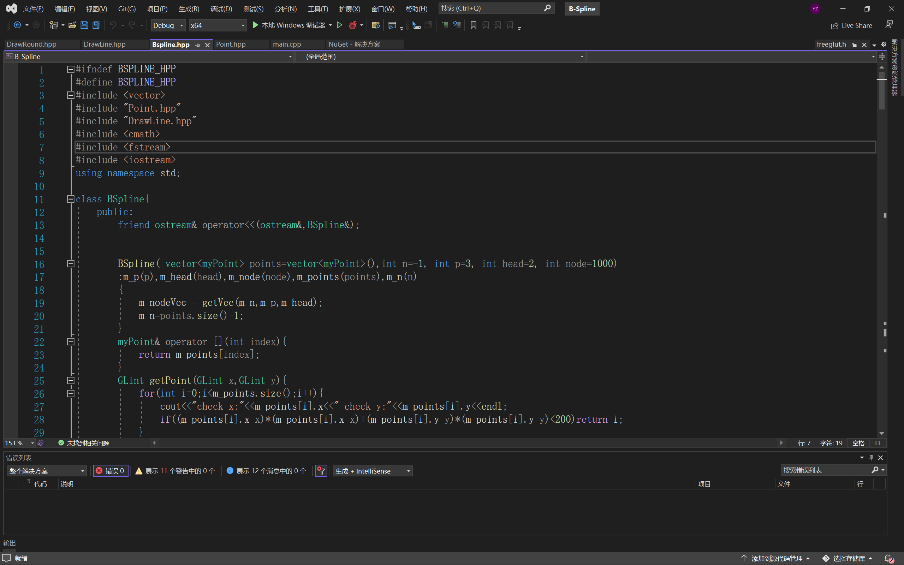
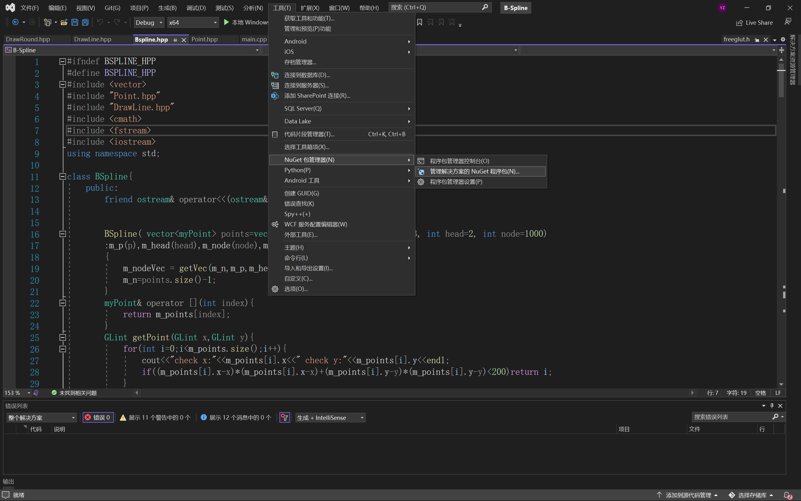
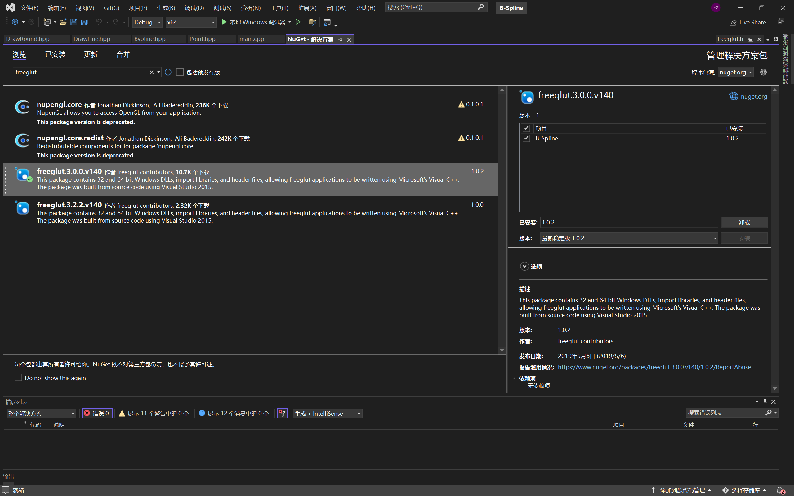

2023.11.29

log:完善了B 样条的绘制，添加了 B 样条的保存、参数修改、导入。添加了 CMakeLists.txt，现在可以使用 Cmake 进行编译。README.md 中还加入的了 Windows 的编译方法。

# B-Spline实现

## 简介
**项目名: 基于OpenGL 的 B-Spline 绘制算法实现。**

**作者: zhywyt**

**日期: 2023-11-29**

## 功能

- 绘制
- 修改
- 保存
- 导入


## 编译

### linux

测试环境：
- Ubuntu 22.04.3 LTS
安装 freeglut
```bash
sudo apt install freeglut3
sudo apt install freeglut3-dev
```
两种编译方式
####  1.g++

`g++ -o demo main.cpp DrawLine.hpp DrawRound.hpp Point.hpp Bspline.hpp -lGL -lGLU -lglut`
#### 2.cmake
```bash
mkdir build
cd build
cmake ..
make
```
### windows
**建议使用 Visual Studio 进行编译，因为 VS 可以非常方便的配置 freeglut 环境。**
**新建一个工程，把代码添加到工程中：**


**然后找到NuGet 包管理器**


**搜索 freeglut 并加载到当前项目。**


**最后回到 main.cpp 运行即可。**

**注：出现任何问题均可联系我，我尽我所能帮你解决编译上的问题。**

**Mainmail: zhywyt@yeah.net**

**HDUmail: zhywyt@hdu.edu.cn**

## 运行
`./demo`
## 用法
**默认为移动模式(Move Mode)**

- **Move Mode**:
  - 左键单击添加点
  - 右键单击停止添加
  - `q` `Q`退出
  - `d` `D`清除所有点
  - `c` `C`切换为选择模式
  - `s` `S`保存当前B样条到指定文件
  - `l` `L`导入B样条
  - `o` `O`进入修改缓冲，按照命令行提示进行操作。
- **Choose Mode**: 
  - 左键单击选择点，选之后可以拖拉移动选择的点。
  - `q` `Q`回到移动模式
  - `d` `D`删除当前选中的点

